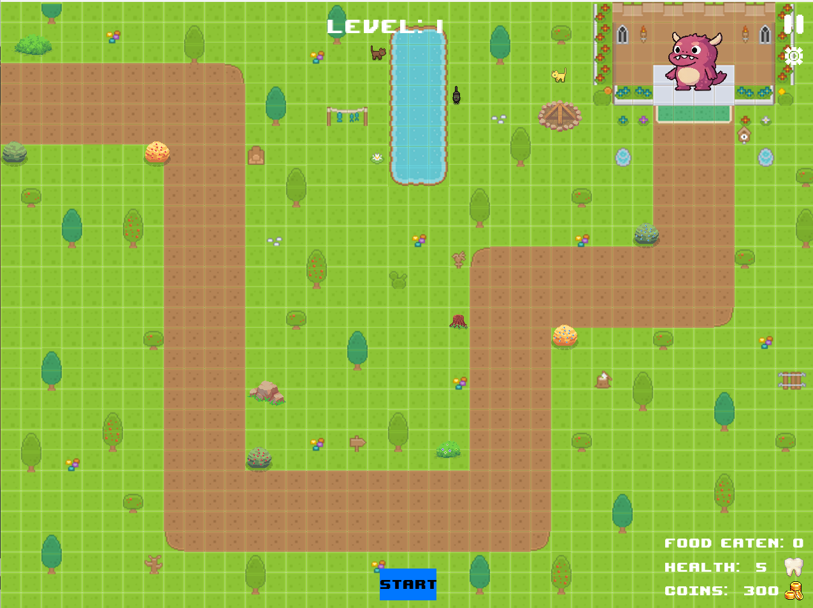

# Libgdx_Game
Collaborative effort to create an educational game for Kids 

A blend of tower defence logic + educational game built with **Java** and **libGDX** that teaches children about nutrition and the consequences of unhealthy eating habits. Players must strategically place towers to target unhealthy food while allowing nutritious options to reach the creature. If too much unhealthy food reaches the creature, it takes damage and eventually leads to game over.

## Game Mechanics

- Tower Defense with an Educational Twist: Traditional tower defense gameplay combined with nutritional education
- Target Selection: Players must identify and target unhealthy foods while allowing healthy foods to pass
- Progression System: Advancing to new levels after reaching specific thresholds
- Economy System: Earn coins to purchase and upgrade towers
- Multiple Levels: Increasing difficulty and new food types as players progress

## Built With

- **Java** & **libGDX** (game framework)
- **Tiled** (level design)
- **Piskel** (sprite creation)
- **Eclipse IDE**

## My Contributions 
(Group project of 5) 

- **Asset Design:** Created original game assets using *Piskel*, *Adobe* and *Libgdx*.
- **Audio Production:** Composed and implemented original music and sound effects. (yea, so i kinda try to produce music for fun w the help of my dear friend) 
- **Core Systems Development:** Built the foundational game architecture and systems. 
- **UI Implementation:** Designed and coded the main menu, game over screen, and options menu.
- **Sound Management:** Developed a comprehensive audio system for managing music and sound effects.
- **Level Design:** Used *Tiled* to do mapping and paths.
  

